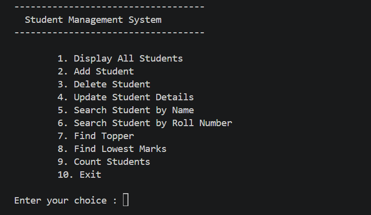
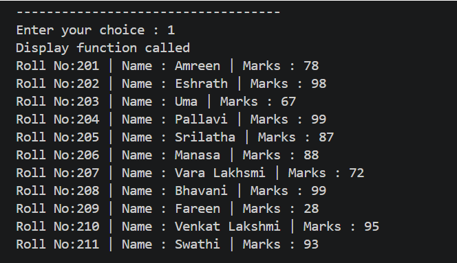
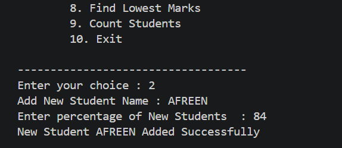
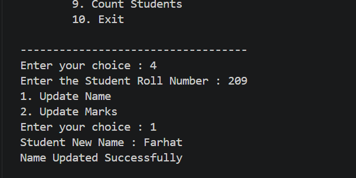
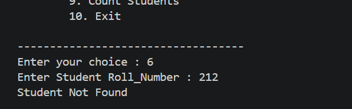
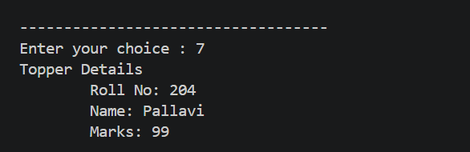
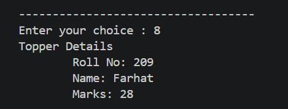
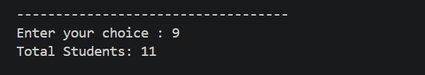

# 🎓 Student Management System (Python)

A simple **menu-driven Student Management System** built using Python.

This project is designed for beginners to practice Python fundamentals such as functions, lists, loops, conditional statements, searching, and CRUD operations.

---

## ✨ Features

- 📋 Display all students
- ➕ Add a new student
- ❌ Delete a student
- ✏️ Update student details
- 🔍 Search student by name
- 🔎 Search student by roll number
- 🏆 Find topper
- 📉 Find student with lowest marks
- 👨‍🎓 Count total students
- 🚪 Exit program

---

## 🛠️ Technologies Used

- Python 3

---

## 📂 Project Structure

```
Student-Management-System/
│
├── student-management-system.py
├── README.md
├── LICENSE
└── .gitignore
└── images
    │
    ├── main-menu
    ├── display-students
    ├── add-student
    ├── update-student
    ├── search-student
    ├── topper
    ├── lowest-marks
    └── total-students
```

---

## ▶️ How to Run

Clone the repository

```bash
git clone https://github.com/tarunreddy17/student--management--system-python-/blob/main/README.md
```

Go to the project folder

```bash
cd Student-Management-System-Python
```

Run the program

```bash
python student-management-system.py
```

---

## 📸 Screenshots

### 🏠 Main Menu



---

### 📋 Display All Students



---

### ➕ Add Student



---

### ✏️ Update Student



---

### 🔍 Search Student



---

### 🏆 Find Topper



---

### 📉 Lowest Marks



---

### 👨‍🎓 Total Students


---

## 📚 Concepts Used

- Lists
- Functions
- Loops
- Conditional Statements
- CRUD Operations
- Searching
- User Input
- Indexing

---

## 🚀 Future Improvements

- Exception Handling
- File Handling
- CSV Storage
- Student Grades
- Sorting Students
- Data Validation
- Object-Oriented Programming (OOP)

---

## 👩‍💻 Author

**tarun reddy**

GitHub:https://github.com/tarunreddy17/student--management--system-python-/edit/main/README.md

---

⭐ If you found this project useful, consider giving it a star.
